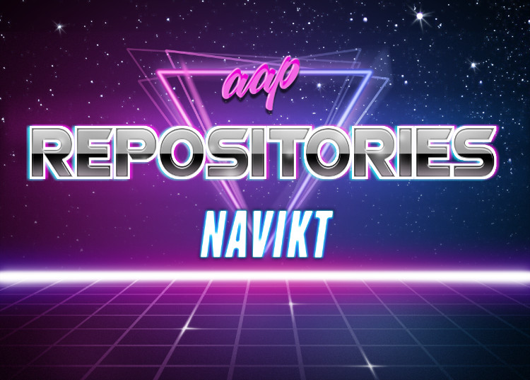

Overview over AAP repositories.

## WebAssembly
When running on WASM this project does not use any backend and is running completely embedded within your browser.
To test locally, just run `trunk serve` and open [http://127.0.0.1:8080/aap_status](http://127.0.0.1:8080/aap_status)

Every commit to main will deploy this to GitHub Pages.

## Native
Runs native with cargo, only tested on macOS.

## Cargo
Using multi crate setup for better incremental build.  
Each crate can use pre-defined libs/crates found in [Cargo.toml](Cargo.toml).  
Explanation:

#### `[workspace]` 
Defines a workspace and its members.

#### `[workspace.dependencies]`
Defines dependencies and local crates to be available uppon request.

#### `[dependencies]` 
The dependencies/crates necessary to run [src/main.rs](src/lib)

#### `[target.'cfg(not(target_arch = "wasm32"))'.dependencies]`
Dependencies used when running native.

#### `[target.'cfg(target_arch = "wasm32")'.dependencies]`
Dependencies use when running WASM.
